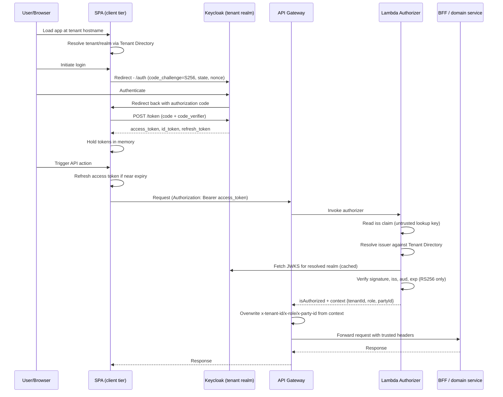
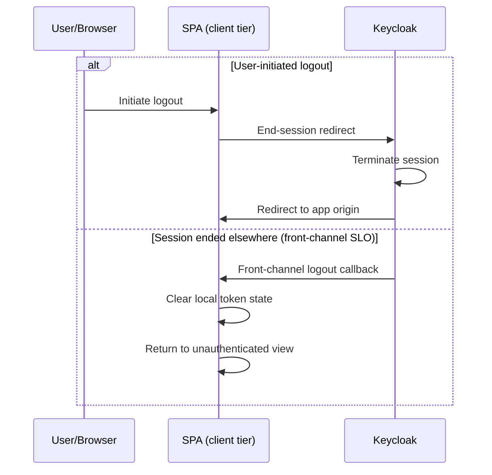
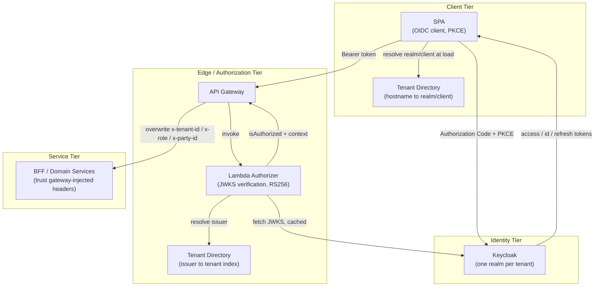

# Authentication & SSO Architecture Reference

**Scope:** the single sign-on architecture for the admin platform — authentication protocol, Keycloak integration, token lifecycle, JWT/claims contract, client and realm configuration, and the integration surface for downstream platform components.

---

## 1. Overview

Authentication is delegated entirely to **Keycloak** as the identity provider, using **OpenID Connect (OIDC) on top of OAuth 2.0**. The platform is multi-tenant: each tenant maps to its own Keycloak realm, resolved dynamically at request time rather than fixed at build time. Authorization context (tenant, role, party identity) is derived from verified JWT claims and propagated to downstream services as trusted, gateway-injected headers — never as client-supplied values.

The architecture has three tiers:

1. **Client tier** — a browser SPA that authenticates the user against the tenant's Keycloak realm and attaches the resulting access token to every API call.
2. **Edge/authorization tier** — an API Gateway fronted by a Lambda-based authorizer that independently verifies the token, resolves tenant context from the token's issuer, and injects trusted identity headers.
3. **Service tier** — backend-for-frontend (BFF) and domain services that consume the trusted headers rather than parsing tokens themselves.

---

## 2. Authentication Protocol

**OpenID Connect (OIDC), Authorization Code flow with PKCE (S256), against public (non-confidential) OAuth 2.0 clients.** SAML is not part of this architecture.

| Property | Value |
|---|---|
| Protocol | OIDC / OAuth 2.0 |
| Grant type | Authorization Code + PKCE (`code_challenge_method=S256`) |
| Client authentication | None — public client, no client secret |
| Token signing algorithm | RS256 (explicitly pinned; algorithm negotiation is not trusted) |
| Direct Access Grants (Resource Owner Password) | Reserved for operational/diagnostic use only — never exposed to the SPA login path |

Rationale for a public client with PKCE rather than a confidential client: the SPA runs entirely in the browser with no secure secret storage, so PKCE substitutes for a client secret to bind the authorization code to the original request and prevent code-interception attacks.

---

## 3. Keycloak Authentication Flow

### 3.1 Multi-tenant realm resolution

Each tenant is provisioned its own Keycloak realm and its own OIDC client within that realm. The platform resolves **which realm/client to authenticate against** from the requesting hostname, via a **Tenant Directory** — a single directory of `hostname → { tenantId, Keycloak URL, realm, clientId }` records.

- The Tenant Directory is published as static, versioned configuration (not a database-backed lookup service), consumed identically by the client tier (keyed by hostname) and the authorization tier (keyed by issuer URL — see §3.3).
- An unresolvable hostname is rejected with a generic message and never reveals which tenants exist — this prevents tenant enumeration via hostname probing.
- Because realm selection happens before any Keycloak client is constructed, a single SPA deployment serves any number of tenants without per-tenant builds.

### 3.2 Login sequence

1. The SPA loads and resolves its tenant/realm from the Tenant Directory.
2. Authentication is user-initiated (explicit login action), not automatic — this keeps the unauthenticated landing experience predictable and avoids masking realm-resolution failures behind a silent redirect loop.
3. Login redirects the full browser to the resolved realm's Keycloak authorization endpoint with a PKCE code challenge, `state`, and `nonce`.
4. After the user authenticates at Keycloak, the browser is redirected back with an authorization code.
5. The SPA exchanges the code (plus the PKCE code verifier) at the realm's token endpoint for an access token, ID token, and refresh token. No client secret is transmitted.

An optional **silent session check** (iframe-based, OIDC `check-sso`) is supported by the architecture for re-establishing a session without a full-page redirect on subsequent loads. This requires the realm to permit being framed by the SPA's origin (CSP `frame-ancestors`) and to allow the SPA's origin as a Web Origin — both are realm-level configuration prerequisites, not client-side concerns (see §10).

### 3.3 Authenticated request flow

Once issued, the access token is presented as a bearer token on every API call. Verification happens once, at the edge, not redundantly at every downstream hop:

1. **API Gateway** receives the request and invokes a **Lambda REQUEST authorizer** before routing to any backend.
2. The authorizer reads the token's `iss` claim *without* trusting it yet — this is a lookup key only, not a verified fact.
3. The authorizer resolves that issuer against the **Tenant Directory's issuer index**. An issuer that doesn't match any provisioned tenant is denied **before** any cryptographic verification is attempted — untrusted input is never passed to the verification step, only used to select which key set to verify against.
4. For a recognized issuer, the authorizer fetches (and caches) that realm's JWKS and verifies the token's signature, issuer, audience, and expiry — algorithm restricted to RS256.
5. On success, the authorizer returns an authorization decision plus a context object (`tenantId`, `role`, `partyId`) derived from verified claims.
6. API Gateway's integration layer **overwrites** (never appends) the corresponding downstream headers (`x-tenant-id`, `x-role`, `x-party-id`) from that verified context — guaranteeing a client cannot forge these headers, since any client-supplied value is replaced, not merged.
7. The request, now carrying only gateway-verified identity headers, reaches the BFF and domain services.
8. Any verification failure produces a generic deny with no detail exposed to the caller — the specific failure reason is available only in the authorizer's own logs, so failure responses can't be used to enumerate valid issuers, tenants, or claim requirements.

This design gives the platform a **single verification point**: downstream services trust the gateway-injected headers as their identity contract and do not need their own JWT-parsing logic. That trust boundary should be treated as a deliberate architectural decision, not an implicit assumption — see §9.

### 3.4 Logout

- **User-initiated logout** ends the Keycloak session and redirects the browser back to the application origin via Keycloak's standard end-session endpoint.
- **Front-channel Single Logout (SLO)**: when a session ends by any other means (another tab, admin-forced termination, idle timeout), Keycloak calls a registered front-channel logout URL on the client, which clears the local token state and returns the user to an unauthenticated view. This route must remain reachable without requiring an existing authenticated session.

---

## 4. Token Lifecycle

### 4.1 Issuance
Issued via the Authorization Code + PKCE exchange described in §3.2: access token, ID token, and refresh token, all scoped to the resolved tenant's realm and client.

### 4.2 Storage
Tokens are held **in memory only**, scoped to the SPA's runtime session object — never persisted to `localStorage`, `sessionStorage`, or cookies. This eliminates persistence-based token theft (e.g., via XSS reading storage) as an attack surface, at the cost of requiring re-authentication on every full page reload unless silent session checking (§3.2) is enabled.

### 4.3 Refresh
The access token is refreshed proactively ahead of expiry, using two independent triggers: a background check tied to the token's own expiry countdown, and a pre-flight check immediately before each outbound API call. Both use the standard refresh-token grant against the realm's token endpoint.

**Refresh tokens are single-use.** Once a refresh succeeds and rotates the token pair, the previous refresh token is invalid. Any refresh attempt against an already-rotated or expired refresh token must fall back to a full re-authentication (login redirect), not a silent retry loop.

### 4.4 Expiry and session termination
- Access token expiry is short-lived and enforced both client-side (proactive refresh) and server-side (the authorizer independently validates `exp` on every request — a client cannot extend its own session by holding onto an expired token).
- Session and refresh-token lifetimes (idle timeout, maximum session duration, refresh token TTL) are realm-level Keycloak settings and must be explicitly set per realm as part of tenant provisioning — see §10.
- The authorizer's own **authorization decision cache** (API Gateway's authorizer result TTL) is a separate, shorter-lived cache of the *authorization outcome*, not of the token itself, and must be set well below the token's own expiry to avoid granting access on a token that has since expired or been revoked.

### Sequence — login through an authorized API call



### Sequence — logout



---

## 5. JWT Structure and Claims

### 5.1 Standard claims

| Claim | Use |
|---|---|
| `iss` | Realm issuer URL — resolves which tenant/realm issued the token; verified against the Tenant Directory before signature check |
| `aud` | Audience — verified to include the tenant's registered client ID |
| `exp` / `nbf` / `iat` | Standard validity window, enforced by the verifier |
| `sub` | Subject (user) identifier — required, non-empty |
| `preferred_username`, `email` | Display/identity metadata for the client tier |
| `realm_access.roles`, `resource_access.<clientId>.roles` | Keycloak's own account-management roles (e.g. profile management) — **not** used for application-level authorization |

### 5.2 Custom claims contract

Application-level authorization is carried by two custom claims, populated via Keycloak protocol mappers on each client (not emitted by a default Keycloak client configuration):

| Claim | Maps to | Description |
|---|---|---|
| `persona` | authorization context `role` | The user's application role/persona (e.g. `admin`, `agent`, `broker`, `employer`) |
| `party_id` | authorization context `partyId` | The identity of the party/organization the user acts on behalf of, used for downstream data scoping |

Every client, in every realm, requires:
- A **User Attribute** protocol mapper for `persona` (String, added to access token).
- A **User Attribute** protocol mapper for `party_id` (String, added to access token).
- An **Audience** protocol mapper including the client's own client ID — Keycloak does not include a client's own ID in `aud` by default, and the authorizer's audience check will reject any token missing it.

Provisioning a new tenant realm or client without these three mappers is an incomplete provisioning step, not a working default — this should be a mandatory item in any tenant-onboarding checklist.

### 5.3 Signature verification

- JWKS retrieved from the issuing realm's standard OIDC JWKS endpoint, cached per issuer to avoid a network round-trip on every request.
- Verification is restricted to **RS256** explicitly — algorithm negotiation from the token header is not trusted, preventing algorithm-confusion/downgrade attacks.
- `iss` and `aud` are checked against the tenant's registered values from the Tenant Directory, not against any value the token itself claims to be correct for.
- Verification failures are collapsed into a single generic denial; the specific failing check is never surfaced to the caller.

### Example access token payload (illustrative shape)

```json
{
  "iss": "https://sso.example.com/realms/<tenant-realm>",
  "aud": "<tenant-client-id>",
  "sub": "e8247c2e-c121-4e82-afc0-6aaed0b33675",
  "exp": 1784807877,
  "iat": 1784807577,
  "preferred_username": "jane.doe",
  "email": "jane.doe@example.com",
  "persona": "admin",
  "party_id": "party-001"
}
```

---

## 6. Client, Realm, Role, and Group Configuration

| Setting | Reference value |
|---|---|
| Client authentication | Off — public client |
| Standard flow (Authorization Code) | On |
| Direct access grants | Off for the app-facing client |
| PKCE method | S256, required |
| Valid redirect URIs | Restricted to the SPA's exact origin(s) — never a wildcard domain |
| Valid post-logout redirect URIs | Restricted to the SPA's exact origin(s) |
| Web origins | Restricted to the SPA's exact origin(s) |
| Front-channel logout | On, pointed at the SPA's logout-callback route |

**Realm model:** one Keycloak realm per tenant. Each realm hosts one OIDC client representing the admin platform SPA, configured identically per the table above and per the mapper requirements in §5.2.

**Roles and groups:** Keycloak's native realm/client role and group model is **not** the mechanism for application-level authorization in this architecture. `realm_access`/`resource_access` roles present in tokens are Keycloak's own account-management roles and should not be interpreted as application permissions. All application authorization flows through the `persona` and `party_id` custom claims (§5.2). This is a deliberate simplification — teams familiar with standard Keycloak RBAC should not assume realm roles drive access control here.

---

## 7. Architecture Diagram



---

## 8. Integration Points for New Platform Components

1. **Tenant Directory as the shared contract.** Any new client surface (new SPA, mobile app, internal tool) or new backend service should resolve tenant/realm/claims through the same Tenant Directory rather than introducing a second, independently-maintained mapping. New services needing issuer-based tenant resolution should read the same issuer index the authorizer uses.
2. **Claim contract is mandatory, not incidental.** `persona`, `party_id`, and a correct Audience mapper must be part of the standard checklist for provisioning any new client against any realm — treat this as a schema, not a convention.
3. **Single verification point, explicit trust boundary.** Services behind the gateway are expected to trust `x-tenant-id`/`x-role`/`x-party-id` without re-verifying a token. New services joining this architecture must be deployed such that they are unreachable except through the gateway — if a new service could be reached directly, it must perform its own verification, and that decision should be made explicitly per service, not assumed.
4. **Silent session renewal has realm-level prerequisites.** Any new client wanting iframe-based silent SSO must have its origin permitted in the realm's CSP `frame-ancestors` and Web Origins settings — this is a per-realm configuration step to plan for during tenant onboarding, not a client-side feature toggle.
5. **Refresh-token single-use semantics.** Any new client implementation must serialize refresh attempts (or accept and gracefully handle rotation failure) rather than assuming concurrent refreshes are safe.
6. **Algorithm and issuer-allowlist-before-verify are non-negotiable security properties** to carry into any new or reimplemented verification logic: pin to RS256 (or the realm's actual configured algorithm — never accept algorithm negotiation from the token itself), and reject unrecognized issuers before attempting cryptographic verification.
7. **Token TTLs and session lifetimes are per-realm configuration, not application defaults.** New tenant onboarding must include explicit realm session/token lifetime configuration as a first-class step, matched to the authorizer's own decision-cache TTL (which must always be set shorter than the token's own lifetime).

---

## 9. Security Design Decisions (carry forward)

- **Deny-before-verify ordering**: unknown issuers are rejected before any cryptographic work is attempted, so unrecognized realms cannot be used to probe or load the verification path.
- **Overwrite, not append, on header injection**: guarantees a client-supplied identity header can never coexist with or mask the gateway-verified one downstream.
- **Generic failure responses**: verification failures never reveal which check failed, whether an issuer is known, or what claims are expected — that detail is confined to server-side logs.
- **In-memory-only token storage**: removes persistent client-side storage as an attack surface for token exfiltration.
- **Algorithm pinning**: verification never trusts the algorithm asserted by the token header.

---

## 10. Operational Prerequisites / Configuration Checklist

Use this checklist when provisioning a new tenant realm or client against this architecture:

- [ ] Realm created with a naming convention consistent across the Tenant Directory and Keycloak itself.
- [ ] Client created: public, Standard Flow only, PKCE S256 required, Direct Access Grants disabled for app-facing use.
- [ ] Redirect URIs, post-logout redirect URIs, and Web Origins restricted to exact application origins (no wildcards).
- [ ] Front-channel logout configured and pointed at the application's logout-callback route.
- [ ] `persona` protocol mapper added (User Attribute, added to access token).
- [ ] `party_id` protocol mapper added (User Attribute, added to access token).
- [ ] Audience protocol mapper added, including the client's own client ID.
- [ ] Realm session idle timeout, max session length, and refresh token lifespan explicitly set (not left as unreviewed defaults).
- [ ] Tenant Directory updated with the new hostname/issuer/realm/client mapping, on both the hostname-keyed and issuer-keyed sides.
- [ ] Authorizer decision-cache TTL confirmed to be shorter than the realm's access token lifetime.
